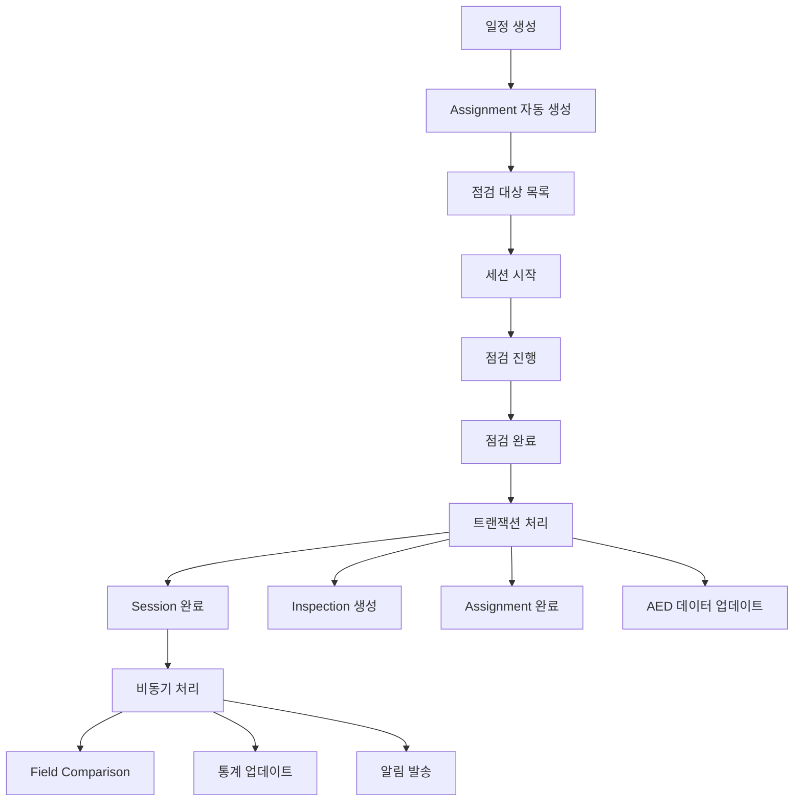

# 점검 데이터 플로우 분석 보고서

**작성일**: 2025-11-05
**분석 범위**: 점검 일정 추가 → 점검 실행 → 점검 완료 → 보고서 생성 전체 플로우

## 목차
1. [데이터베이스 구조 분석](#1-데이터베이스-구조-분석)
2. [플로우별 데이터 흐름 분석](#2-플로우별-데이터-흐름-분석)
3. [발견된 문제점](#3-발견된-문제점)
4. [개선 권장사항](#4-개선-권장사항)

---

## 1. 데이터베이스 구조 분석

### 점검 관련 핵심 테이블

#### 1.1 `inspection_schedules` (점검 일정)
- **용도**: 예정된 점검 일정 관리
- **주요 필드**:
  - `aed_data_id` (INTEGER) - AED 장비 ID
  - `equipment_serial` (VARCHAR) - 장비 시리얼 번호
  - `scheduled_for` (TIMESTAMP) - 예정 일시
  - `assignee_identifier` (VARCHAR) - 할당된 사용자
  - `status` (VARCHAR) - pending/completed/cancelled

#### 1.2 `inspection_assignments` (점검 할당)
- **용도**: 점검자에게 할당된 장비 관리
- **주요 필드**:
  - `equipment_serial` (VARCHAR) - 장비 시리얼 번호
  - `assigned_to` (UUID) - 점검자 ID
  - `status` (assignment_status) - pending/in_progress/completed/cancelled
  - `started_at` (TIMESTAMP) - 점검 시작 시간
  - `completed_at` (TIMESTAMP) - 점검 완료 시간

#### 1.3 `inspection_sessions` (점검 세션)
- **용도**: 진행 중인 점검 세션 관리
- **주요 필드**:
  - `equipment_serial` (VARCHAR) - 장비 시리얼 번호
  - `inspector_id` (UUID) - 점검자 ID
  - `status` (session_status enum) - active/paused/completed/cancelled
  - `current_step` (INTEGER) - 현재 점검 단계
  - `step_data` (JSON) - 단계별 입력 데이터
  - `device_info` (JSON) - 장비 정보 스냅샷

#### 1.4 `inspections` (점검 결과)
- **용도**: 완료된 점검 기록 영구 저장
- **주요 필드**:
  - `equipment_serial` (VARCHAR) - 장비 시리얼 번호
  - `inspector_id` (UUID) - 점검자 ID
  - `inspection_date` (DATE) - 점검 날짜
  - `overall_status` (VARCHAR) - 전체 점검 상태
  - `original_data` (JSON) - 점검 전 원본 데이터
  - `inspected_data` (JSON) - 점검 후 확인 데이터
  - `photos` (String[]) - 사진 URL 배열

#### 1.5 `inspection_field_comparisons` (필드 비교)
- **용도**: 점검 전후 필드 변경사항 추적
- **주요 필드**:
  - `inspection_id` (UUID) - 점검 ID
  - `equipment_serial` (VARCHAR) - 장비 시리얼 번호
  - `field_name` (VARCHAR) - 필드명
  - `inspection_value` (VARCHAR) - 점검 시 값
  - `aed_data_value` (VARCHAR) - DB 저장 값
  - `improvement_status` (VARCHAR) - 개선 상태

---

## 2. 플로우별 데이터 흐름 분석

### 2.1 일정 추가 플로우

#### 정상 흐름
```
1. POST /api/schedules 요청
   ↓
2. inspection_schedules 테이블에 신규 레코드 생성
   - aed_data_id와 equipment_serial 동시 저장
   - status = 'pending'으로 초기화
   ↓
3. 중복 체크 (30분 윈도우)
   ↓
4. 성공 응답 반환
```

#### ✅ 데이터 정합성
- **Good**: aed_data_id와 equipment_serial을 모두 저장하여 참조 무결성 보장
- **Good**: 30분 시간 윈도우로 중복 일정 방지
- **Good**: created_by 필드로 일정 생성자 추적 가능

#### ⚠️ 잠재적 문제
- **Issue**: inspection_assignments와 inspection_schedules 간 동기화 메커니즘 없음
- **Risk**: 같은 장비에 대해 schedule과 assignment가 별도로 존재 가능

### 2.2 점검 세션 시작 플로우

#### 정상 흐름
```
1. POST /api/inspections/sessions 요청
   ↓
2. inspection_assignments 확인
   - 할당되지 않은 장비는 점검 불가 (403 반환)
   ↓
3. assignment status를 'in_progress'로 업데이트
   ↓
4. inspection_sessions 테이블에 신규 세션 생성
   - status = 'active'
   - current_step = 0
   - device_info에 aed_data 스냅샷 저장
   ↓
5. 세션 정보 반환
```

#### ✅ 데이터 정합성
- **Good**: assignment 기반 권한 관리로 무단 점검 방지
- **Good**: device_info에 스냅샷 저장으로 점검 시점 데이터 보존
- **Good**: assignment와 session 상태 동기화

#### ⚠️ 잠재적 문제
- **Issue**: 동일 장비에 대한 중복 세션 생성 가능
- **Issue**: assignment의 started_at 업데이트 실패 시 롤백 없음 (트랜잭션 미사용)

### 2.3 점검 완료 플로우

#### 정상 흐름
```
1. PATCH /api/inspections/sessions (status='completed')
   ↓
2. 트랜잭션 시작
   ↓
3. inspection_sessions 업데이트
   - status = 'completed'
   - completed_at = now()
   ↓
4. inspections 테이블에 신규 레코드 생성
   - original_data = session의 device_info (원본)
   - inspected_data = step_data (점검 데이터)
   ↓
5. aed_data.last_inspection_date 업데이트
   ↓
6. 트랜잭션 커밋
   ↓
7. inspection_assignments 업데이트 (트랜잭션 외부)
   - status = 'completed'
   - completed_at = now()
   ↓
8. 비동기: inspection_field_comparisons 생성
```

#### ✅ 데이터 정합성
- **Good**: 트랜잭션 사용으로 session과 inspection 동기화 보장
- **Good**: original_data와 inspected_data 분리 저장으로 변경사항 추적 가능
- **Good**: 비동기 필드 비교로 응답 속도 영향 없음

#### ⚠️ 잠재적 문제
- **Critical**: inspection_assignments 업데이트가 트랜잭션 외부에서 실행
  - 실패 시 assignment는 'in_progress' 상태로 남음
  - 재점검 시도 시 혼란 발생 가능
- **Issue**: inspection_field_comparisons 생성 실패 시 재시도 메커니즘 없음

### 2.4 보고서 및 대시보드 플로우

#### 점검 이력 조회
```
GET /api/inspections/history
   ↓
inspections 테이블 조회
   - user_profiles 조인 (점검자 정보)
   - aed_data 조인 (위치 정보)
   ↓
step_data = inspected_data 매핑
```

#### 통계 데이터 조회
```
GET /api/inspections/stats
   ↓
병렬 쿼리 실행:
   - inspections 테이블 집계
   - inspection_sessions 진행 중 카운트
   - 지역별/상태별 그룹핑
```

#### ✅ 데이터 정합성
- **Good**: inspected_data를 step_data로 매핑하여 일관된 인터페이스 제공
- **Good**: 병렬 쿼리로 성능 최적화

#### ⚠️ 잠재적 문제
- **Issue**: 시간대(timezone) 처리 불일치 가능성
  - inspection_date는 DATE 타입
  - created_at는 TIMESTAMPTZ 타입
  - 통계 집계 시 날짜 경계 혼란 가능

---

## 3. 발견된 문제점

### 3.1 중요도: Critical 🔴

#### 문제 1: Assignment 상태 업데이트 트랜잭션 누락
**위치**: `/api/inspections/sessions/route.ts` (line 663-675)

```typescript
// 트랜잭션 외부에서 실행 - 실패 시 불일치 발생
await prisma.inspection_assignments.updateMany({
  where: { equipment_serial, assigned_to, status: { in: ['pending', 'in_progress'] } },
  data: { status: 'completed', completed_at: new Date() }
});
```

**영향**:
- 점검은 완료되었으나 assignment는 미완료 상태 유지 가능
- 점검 대상 목록에 완료된 장비가 계속 표시
- 재점검 시도 시 오류 발생

**해결책**:
```typescript
// 트랜잭션 내부로 이동
const completedSession = await prisma.$transaction(async (tx) => {
  // ... 기존 코드 ...

  // Assignment도 트랜잭션 내에서 업데이트
  await tx.inspection_assignments.updateMany({
    where: { equipment_serial, assigned_to, status: { in: ['pending', 'in_progress'] } },
    data: { status: 'completed', completed_at: new Date() }
  });

  return updated;
});
```

#### 문제 2: 중복 세션 생성 가능
**위치**: `/api/inspections/sessions/route.ts` (line 278-286)

**현상**: 동일 장비에 대해 여러 active 세션 생성 가능

**해결책**:
```typescript
// 세션 생성 전 중복 체크 추가
const existingSession = await prisma.inspection_sessions.findFirst({
  where: {
    equipment_serial: payload.equipment_serial,
    status: { in: ['active', 'paused'] }
  }
});

if (existingSession) {
  return NextResponse.json(
    { error: '이미 진행 중인 점검 세션이 있습니다.', sessionId: existingSession.id },
    { status: 409 }
  );
}
```

### 3.2 중요도: High 🟠

#### 문제 3: Schedule과 Assignment 비동기화
**현상**: inspection_schedules와 inspection_assignments가 독립적으로 운영

**영향**:
- 일정 추가 시 자동 할당 안 됨
- 할당 없는 일정 존재 가능
- UI에서 혼란 발생

**해결책**:
- Schedule 생성 시 자동으로 Assignment 생성
- 또는 Schedule 테이블 제거하고 Assignment만 사용

#### 문제 4: 시간대 불일치
**현상**: DATE vs TIMESTAMPTZ 혼용

**영향**:
- 통계 집계 시 날짜 경계 오류
- 보고서에서 날짜 표시 불일치

**해결책**:
- 모든 날짜/시간 필드를 TIMESTAMPTZ로 통일
- 또는 명시적 시간대 변환 로직 추가

### 3.3 중요도: Medium 🟡

#### 문제 5: 에러 핸들링 부재
**위치**: 여러 API 엔드포인트

**현상**:
- Assignment 업데이트 실패 시 로그만 남기고 진행
- Field comparison 실패 시 재시도 없음

**해결책**:
- 중요 작업 실패 시 재시도 메커니즘 구현
- 실패 알림 시스템 구축

---

## 4. 개선 권장사항

### 4.1 즉시 조치 필요

1. **Assignment 트랜잭션 처리**
   - 점검 완료 시 모든 관련 테이블을 단일 트랜잭션으로 처리
   - 예상 작업 시간: 2시간

2. **중복 세션 방지**
   - 세션 생성 전 중복 체크 로직 추가
   - 예상 작업 시간: 1시간

### 4.2 단기 개선 (1주일 내)

1. **Schedule-Assignment 통합**
   - 두 테이블의 역할 명확히 구분 또는 통합
   - 자동 동기화 메커니즘 구현
   - 예상 작업 시간: 8시간

2. **시간대 통일**
   - 모든 날짜/시간 필드 타입 검토
   - 마이그레이션 스크립트 작성
   - 예상 작업 시간: 4시간

### 4.3 중기 개선 (1개월 내)

1. **에러 복구 시스템**
   - 재시도 큐 구현
   - 실패 알림 시스템
   - 예상 작업 시간: 16시간

2. **데이터 일관성 검증 도구**
   - 정기적 데이터 무결성 체크
   - 불일치 자동 복구
   - 예상 작업 시간: 24시간

### 4.4 권장 아키텍처 개선



---

## 결론

현재 시스템은 기본적인 점검 플로우는 정상 작동하나, 데이터 일관성과 트랜잭션 처리에서 개선이 필요합니다.

### 핵심 개선 포인트
1. **트랜잭션 범위 확대** - 점검 완료 시 모든 업데이트를 원자적으로 처리
2. **중복 방지 강화** - 세션, 일정, 할당의 중복 생성 방지
3. **동기화 메커니즘** - Schedule과 Assignment 간 자동 동기화

### 예상 효과
- 데이터 불일치 문제 해결
- 사용자 혼란 감소
- 시스템 신뢰성 향상

---

**작성자**: Claude (AI Assistant)
**검토 필요**: 개발팀
**다음 단계**: Critical 이슈부터 순차적 해결