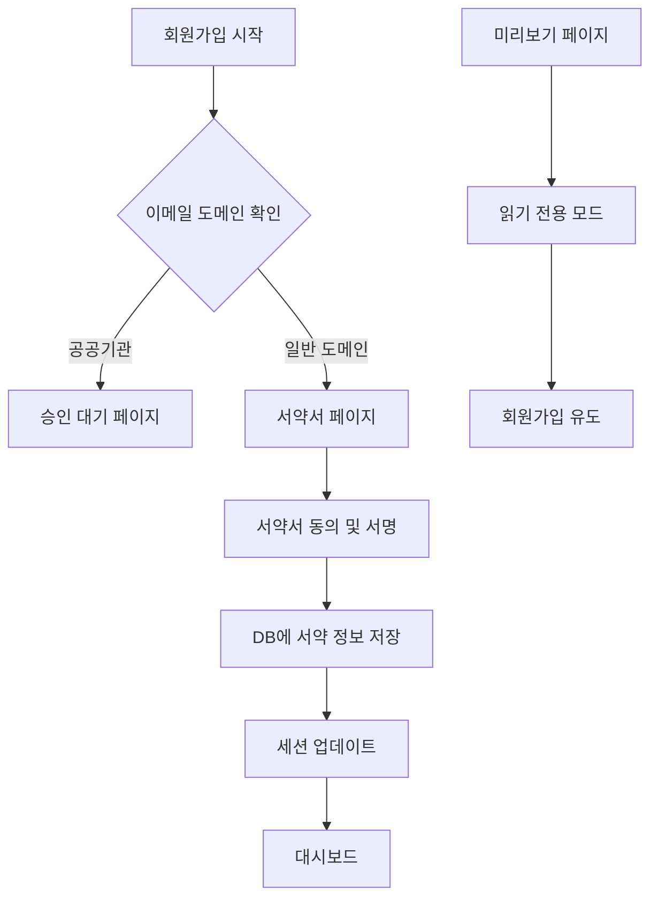

# 보안 서약서 회원가입 통합 가이드

## 개요
임시점검원이 회원가입 과정에서 보안 서약서에 동의하도록 통합하는 가이드입니다.
보안 서약서는 **회원가입 시 1회만** 작성하며, 이후 점검 시에는 체크하지 않습니다.

## 미리보기 페이지 접근
- **URL**: https://aed.pics/security-pledge-preview
- **용도**: 이메일 인증 없이 보안 서약서 내용을 미리 확인
- **특징**: 체크박스와 서명이 비활성화된 읽기 전용 모드

## 구현 방식

### 1. 회원가입 플로우 수정

#### Step 1: 이메일 도메인 확인
```typescript
// app/auth/signup/page.tsx
const handleSignUpComplete = async (formData: SignUpData) => {
  // 회원가입 API 호출
  const response = await fetch('/api/auth/signup', {
    method: 'POST',
    headers: { 'Content-Type': 'application/json' },
    body: JSON.stringify(formData),
  });

  if (response.ok) {
    const data = await response.json();

    // 도메인 기반 분기 처리
    const emailDomain = formData.email.split('@')[1];

    if (['korea.kr', 'nmc.or.kr'].includes(emailDomain)) {
      // 공공기관 사용자: 서약서 없이 승인 대기
      router.push('/pending-approval');
    } else {
      // 임시점검원: 서약서 페이지로 이동
      router.push('/security-pledge');
    }
  }
};
```

#### Step 2: 서약서 페이지에서 완료 처리
```typescript
// app/security-pledge/page.tsx
import { SecurityPledge } from "@/components/security/SecurityPledge";
import { useRouter } from "next/navigation";

export default function SecurityPledgePage() {
  const router = useRouter();

  const handlePledgeComplete = () => {
    // 서약서 작성 완료 후 대시보드로 이동
    router.push('/dashboard');
  };

  return (
    <SecurityPledge
      preview={false}
      onComplete={handlePledgeComplete}
      redirectTo="/dashboard"
    />
  );
}
```

### 2. API 수정 - 회원가입 시 역할 설정

```typescript
// app/api/auth/signup/route.ts
export async function POST(request: Request) {
  const body = await request.json();
  const { email, password, name, phone, organization } = body;

  // 이메일 도메인 확인
  const emailDomain = email.split('@')[1];
  const isPublicDomain = ['korea.kr', 'nmc.or.kr'].includes(emailDomain);

  // 사용자 생성
  const user = await prisma.user_profiles.create({
    data: {
      email,
      password_hash: hashedPassword,
      name,
      phone,
      organization_id: organization,
      // 도메인 기반 역할 설정
      role: isPublicDomain ? 'pending_approval' : 'temporary_inspector',
      is_active: true,
    },
  });

  // 임시점검원은 바로 활성화, 공공기관은 승인 대기
  if (!isPublicDomain) {
    // 임시점검원은 서약서 작성 후 바로 사용 가능
    await prisma.user_profiles.update({
      where: { id: user.id },
      data: { approved_at: new Date() },
    });
  }

  return NextResponse.json({
    success: true,
    requiresPledge: !isPublicDomain,
    redirectTo: isPublicDomain ? '/pending-approval' : '/security-pledge',
  });
}
```

### 3. Middleware 수정 - 서약서 체크 로직

```typescript
// middleware.ts
import { getToken } from 'next-auth/jwt';

export async function middleware(request: NextRequest) {
  const pathname = request.nextUrl.pathname;

  // 서약서 관련 페이지는 체크 제외
  if (pathname.startsWith('/security-pledge')) {
    return NextResponse.next();
  }

  const token = await getToken({ req: request });

  if (token?.role === 'temporary_inspector') {
    // 서약서 작성 여부 확인 (세션에 저장)
    const hasPledge = token.hasPledge as boolean;

    // 보호된 페이지 접근 시 서약서 체크
    const protectedRoutes = ['/inspection', '/dashboard', '/aed-data'];
    const isProtected = protectedRoutes.some(route => pathname.startsWith(route));

    if (isProtected && !hasPledge) {
      // 서약서 미작성 시 서약서 페이지로 리다이렉트
      const pledgeUrl = new URL('/security-pledge', request.url);
      pledgeUrl.searchParams.set('from', pathname);
      return NextResponse.redirect(pledgeUrl);
    }
  }

  return NextResponse.next();
}
```

### 4. NextAuth 콜백 수정

```typescript
// lib/auth/auth-options.ts
export const authOptions: NextAuthOptions = {
  callbacks: {
    async jwt({ token, user, trigger, session }) {
      if (user) {
        token.id = user.id;
        token.role = user.role;
        token.email = user.email;

        // 임시점검원 서약서 체크
        if (user.role === 'temporary_inspector') {
          const pledge = await prisma.security_pledges.findFirst({
            where: {
              user_id: user.id,
              pledge_type: 'temporary_inspector_pledge',
            },
          });
          token.hasPledge = !!pledge;
        }
      }

      // 서약서 작성 후 세션 업데이트
      if (trigger === 'update' && session?.hasPledge) {
        token.hasPledge = true;
      }

      return token;
    },
    async session({ session, token }) {
      if (session.user) {
        session.user.id = token.id as string;
        session.user.role = token.role as string;
        session.user.hasPledge = token.hasPledge as boolean;
      }
      return session;
    },
  },
};
```

## 테스트 시나리오

### 시나리오 1: 임시점검원 가입
1. gmail.com 등 일반 도메인으로 회원가입
2. 회원가입 완료 → `/security-pledge`로 자동 이동
3. 서약서 내용 확인 및 동의
4. 전자서명 완료
5. "동의하고 계속하기" 클릭
6. `/dashboard`로 이동

### 시나리오 2: 공공기관 사용자 가입
1. korea.kr 또는 nmc.or.kr 도메인으로 회원가입
2. 회원가입 완료 → `/pending-approval`로 자동 이동
3. 서약서 페이지 표시 안 됨
4. 관리자 승인 대기

### 시나리오 3: 미리보기 페이지 접근
1. 직접 URL 입력: `/security-pledge-preview`
2. 서약서 내용 확인 (읽기 전용)
3. 체크박스 비활성화 상태 확인
4. 서명 영역 비활성화 확인
5. "회원가입하러 가기" 버튼 확인

### 시나리오 4: 서약서 작성 후 재로그인
1. 서약서 작성 완료한 임시점검원 계정
2. 로그아웃 후 재로그인
3. 서약서 페이지 건너뛰고 바로 대시보드 접근
4. 점검 페이지 정상 접근 확인

## 데이터 흐름



## 주의사항

1. **서약서는 1회만 작성**
   - 회원가입 시에만 작성
   - 이후 점검할 때마다 다시 작성하지 않음

2. **도메인 기반 분기**
   - korea.kr, nmc.or.kr: 서약서 제외
   - 기타 도메인: 서약서 필수

3. **미리보기 페이지**
   - 인증 없이 접근 가능
   - 실제 제출 불가능
   - 테스트 및 확인 용도

4. **세션 관리**
   - hasPledge 상태를 토큰에 저장
   - 서약서 작성 후 즉시 업데이트

## 관련 파일
- `/app/security-pledge/page.tsx` - 실제 서약서 페이지
- `/app/security-pledge-preview/page.tsx` - 미리보기 페이지
- `/components/security/SecurityPledge.tsx` - 서약서 컴포넌트
- `/app/api/security-pledge/route.ts` - 서약서 API
- `/lib/middleware/security-pledge-check.ts` - 미들웨어 체크 함수